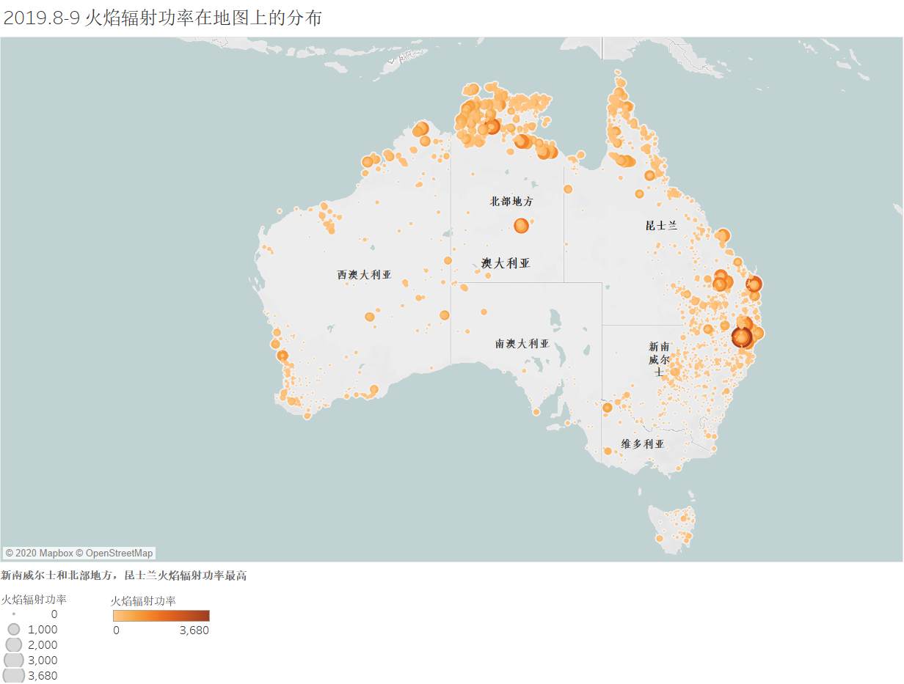
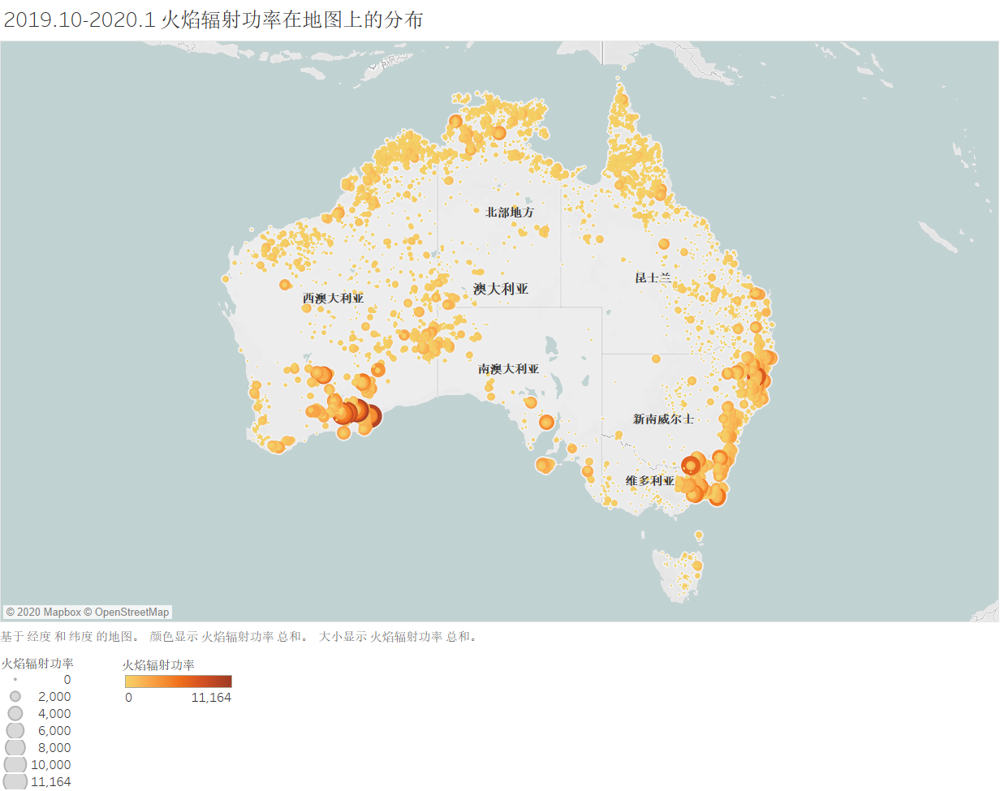
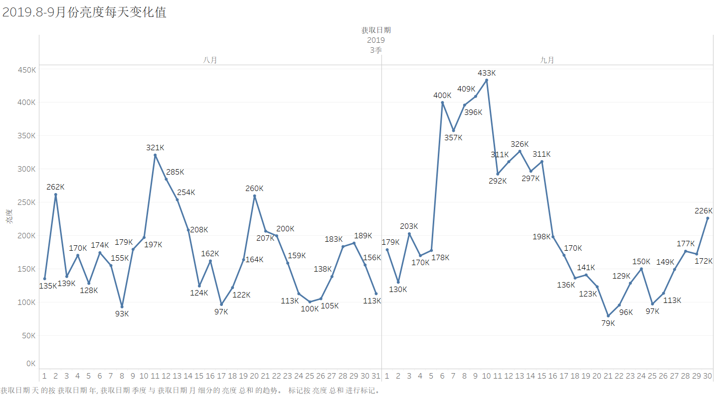
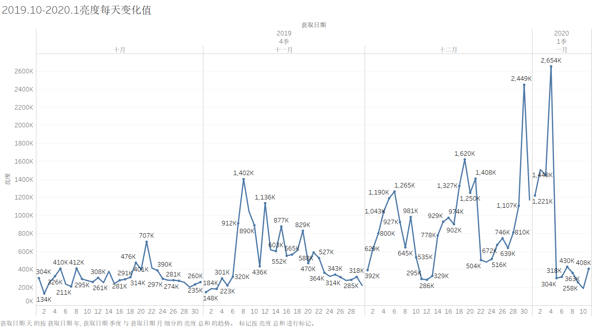

# 澳大利亚火山数据故事
---
### 澳大利亚丛林大火是否和这次疫情有关系
##### （若想查看可视化图片得详细信息，可在下载twbx格式文件后进行交互）
##### （图片若无法显示，可前往images文件夹查看）

### 这是来自VIIRS 375m卫星仪器的数据：

  

### 从数据我们可以看出火焰扩散十分明显，火焰的辐射功率也大大增加
### 2019年8月至12月31日，澳大利亚东南部新南威尔士州、维多利亚州、南澳大利亚州等多地发生严重山火，过火面积超过600万公顷，已造成20多人死亡，2000多所房屋被毁，当地数以千计的民众被迫离开家。

### 澳洲城市里烟尘铺天盖地而来，完全分不清天地南北，也不知是在火星还是核冬天。地上是大火，天上下起烧焦的灰烬。澳大利亚是发达国家，灭火设备先进，消防队伍素质过硬，预警机制完善，避难场所普及，可面对大火就是无计可施。澳洲灭火最有效的武器，居然是以火攻火，这样做代价当然也大，要是东风不与周郎便，风向稍微变化一下，就是引火烧身的局面。

### 以下墨尔本市区的样子，无法想象靠近郊区的人们的生活环境。
  

## 到底为什么会造成这样的大火？其中的原因是什么？
### 造成大火的原因还是与当地常年的气候相关

### 从两组数据我们都可以看出白天火焰的亮度都是远大于夜晚的，从8月份中等火焰占比最多到10月份高温度占比最多也可以看出火势越来越大。
### 一般认为，晴天少云、气温高和大风天气，使得空气湿度降低，各种可燃物的含水量也下降，这样最易发生火灾。
- 澳洲当地遍布喜火植物，其中桉树中的桉油在高温下会自燃。由于气候变化的影响。
- 澳大利亚在2019年普遍高温和干旱。平均最高气温破纪录达到41.9度，部分地区达到49度以上。在这种情况下，普遍性的山火已经是不可避免的了。
- 澳大利亚白天高温50°C创80年记录，有些地方在半小时内夜晚直接降温20°C，气象条件与火灾的关系非常密切。自然界中各种可燃物的着火点，就取决于大气中气象条件的变化。例如湿度的大小、气温的高低、降水量的多少、风力的强弱等。
- 猛烈的山火会制造火风暴，导致闪电，并将易燃物抛向极远处。在这种情况下，人为点火在火灾成因中占比很小。而且并无证据证明今年的人为失火情况超过历年。  
- 火灾发生的次数和危害程度以冬、春季最多，最严重，秋季次之，夏季最少。  

  

### 上面两组数据记录了大火8月份到一月份每天的火焰亮度，注意看纵坐标明显的变化，气候原因使大火愈演愈烈  

### 由上面两组图可以看出亮度温度越高，火焰辐射功率更大

## 那这些和这次新型冠状病毒肺炎有什么关系？
#### 北京一位不愿透露姓名的文化杂家，说到：2019年9月至2020年3月底的澳大利亚森林大火震惊世界，烧毁了58000平方公里的森林，相当于澳大利亚森林总面积的21%。这场大火，还烧死了5亿至10亿只动物和数百万只甚至上千万只蝙蝠，使许多蝙蝠失去栖息地。惊飞的蝙蝠大批飞入人类社区，导致蝙蝠泛滥成灾，它们就像是大爆炸产生的碎片，狠狠地击中了我们人类！

  

#### 他强调说，去年9月至今年3月发生的澳大利亚森林大火，是当今世界上发生的，蝙蝠与人类、蝙蝠与其他动物突然拉近距离的最大，也是最严重的一次生态危机和生物灾害事件。对此，人们关注得并不够。发生突变的蝙蝠病毒或蝙蝠新物种身上的病毒，可能就是新型冠状病毒。蝙蝠携带这种病毒接近了人类，将病毒通过禽畜、宠物或其他动物传染人类，也可能通过污染水源、食物和抓伤、咬伤人等途径，以及森林大火产生含毒气溶胶的方式，直接传染了人类，创造了新冠肺炎"零号病人"。

### "零号病人"甚至整个感染第一代新冠病毒的患者，可能起初都是无症状或轻症状的感染者，并且这种病毒在初始阶段可能传染性、致命性不强，甚至潜伏期也更长。这样，人们就很难立即发现这种疾病和这种病毒，直到它已经变异为第二代的时候，才突然呈现出可明显辨认的种种特征，具备了惊人的传染性和攻击性。
### 他说，他的这个猜想，或许能够帮助科学家们解答那个使他们大惑不解的问题，即：自然界的病毒是怎么转化为人类疾病的？这个过程究竟是怎么发生的？他重复强调，当蝙蝠突然失去栖息地后，就可能打破常规飞越"卡佩蒂峡谷"，以超乎人类想象的方式去侵犯人类。
### 澳大利亚森林大火对全球生态、气候及疫情的影响，远远超过"蝴蝶效应"
### 当然以上都只是他个人的猜想，背后具体的原因我们也不得而知...

### 这场触目惊心的大火几乎持续了半年才得以熄灭,但它带来的“后遗症”远是我们无法想象的...