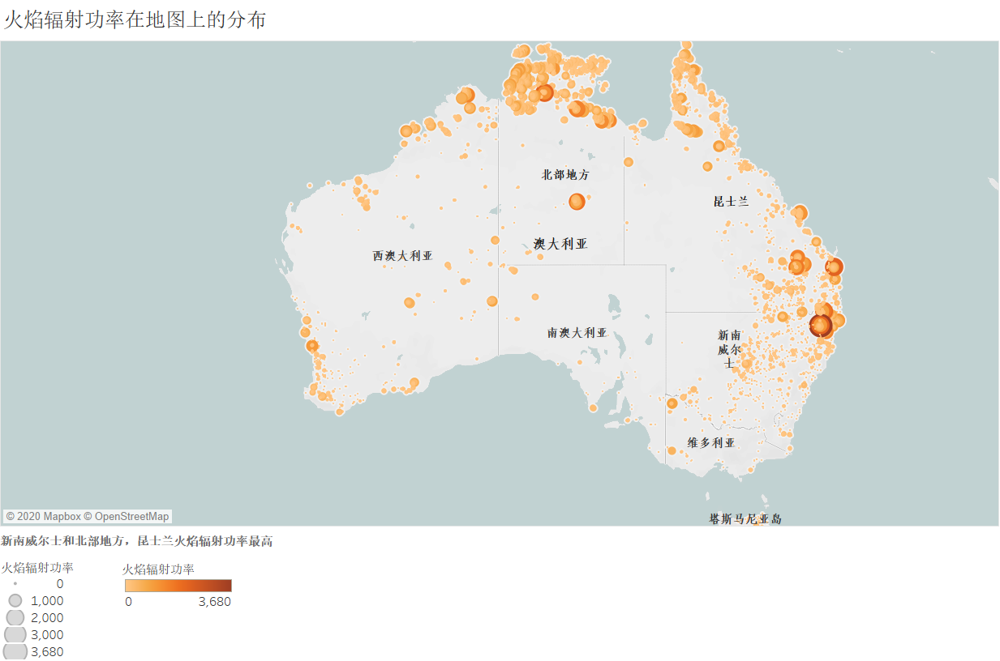
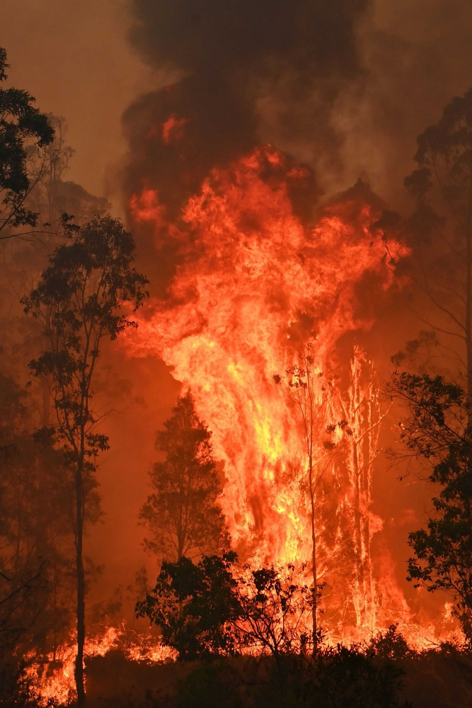
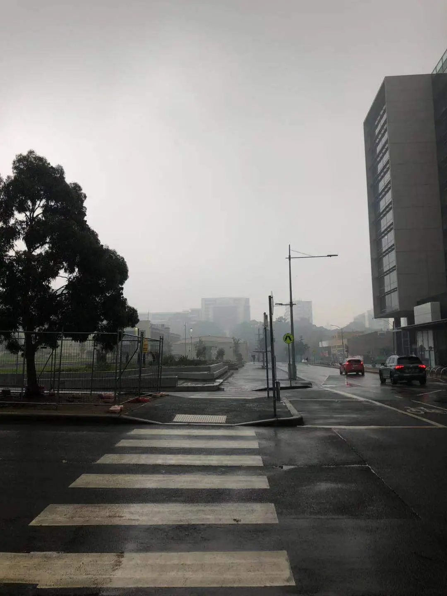
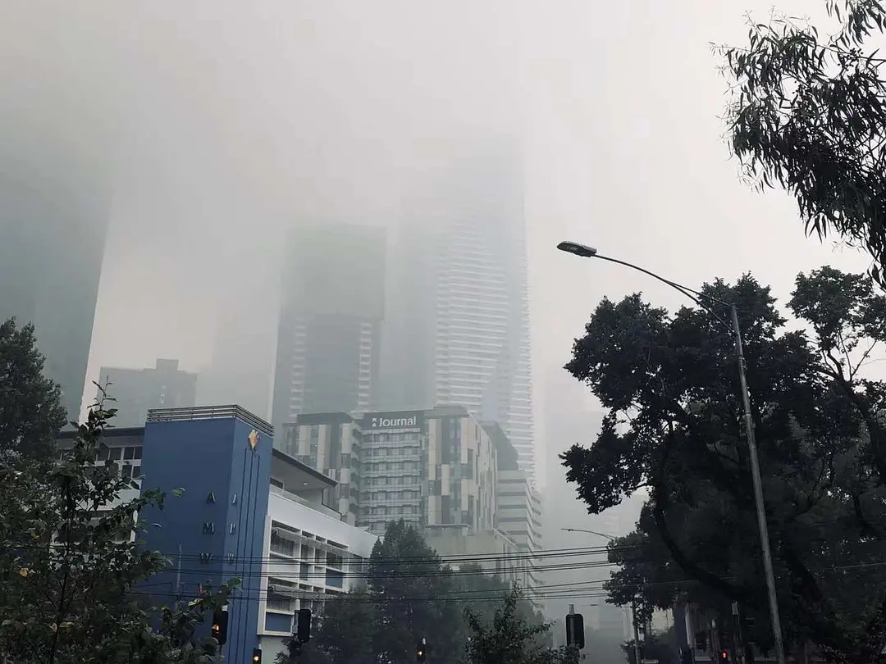
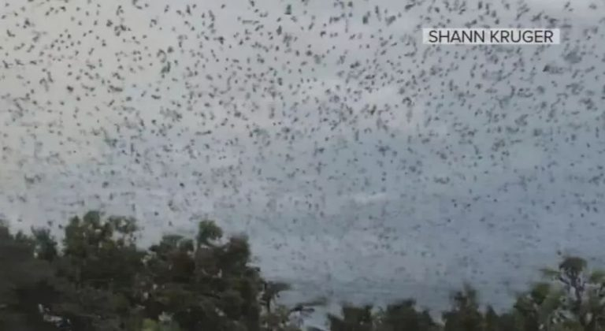
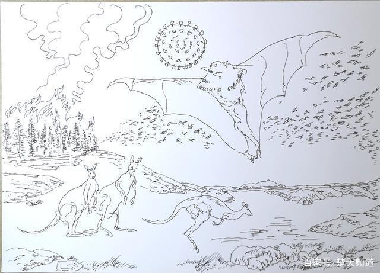
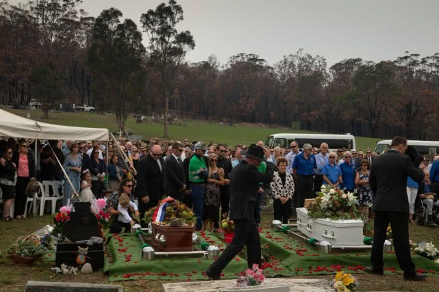

# 澳大利亚火山数据故事
## 澳大利亚大火与这次疫情有关？

### 这是来自VIIRS 375m卫星仪器的数据：

### 2019年9月至12月31日，澳大利亚东南部新南威尔士州、维多利亚州、南澳大利亚州等多地发生严重山火，过火面积超过600万公顷，已造成20多人死亡，2000多所房屋被毁，当地数以千计的民众被迫离开家。

### 澳洲城市里烟尘铺天盖地而来，完全分不清天地南北，也不知是在火星还是核冬天。地上是大火，天上下起烧焦的灰烬。澳大利亚是发达国家，灭火设备先进，消防队伍素质过硬，预警机制完善，避难场所普及，可面对大火就是无计可施。澳洲灭火最有效的武器，居然是以火攻火，这样做代价当然也大，要是东风不与周郎便，风向稍微变化一下，就是引火烧身的局面。

### 以下墨尔本市区的样子，无法想象靠近郊区的人们的生活环境。
  

## 到底为什么会造成这样的大火？其中的原因是什么？
### 造成大火的原因还是与当地常年的气候相关

  

- 澳洲当地遍布喜火植物，其中桉树中的桉油在高温下会自燃。由于气候变化的影响。
- 澳大利亚在2019年普遍高温和干旱。平均最高气温破纪录达到41.9度，部分地区达到49度以上。在这种情况下，普遍性的山火已经是不可避免的了。
- 澳大利亚白天高温50°C创80年记录，有些地方在半小时内夜晚直接降温20°C，气象条件与火灾的关系非常密切。自然界中各种可燃物的着火点，就取决于大气中气象条件的变化。例如湿度的大小、气温的高低、降水量的多少、风力的强弱等。
- 猛烈的山火会制造火风暴，导致闪电，并将易燃物抛向极远处。在这种情况下，人为点火在火灾成因中占比很小。而且并无证据证明今年的人为失火情况超过历年。  
- 火灾发生的次数和危害程度以冬、春季最多，最严重，秋季次之，夏季最少。  

  

### 一般认为，晴天少云、气温高和大风天气，使得空气湿度降低，各种可燃物的含水量也下降，这样最易发生火灾。

### 灾期间，被烧伤的考拉照片和视频尤其受到世人关注，它们速度缓慢，只能在茫然地躲避大火待人援救，有文章作出“考拉已经功能性灭绝”的感叹。
### 这个论断是澳大利亚一家考拉保护组织作出的。但事实上，确实有大量考拉葬身火海，但和“功能性灭绝”还有相当的距离。美国国家地理采访了多位专家，否认了这类说法。澳大利亚在2016年约有32万9千只考拉，火灾波及的区域考拉数量有一定的损失，但还需要长期的观察才能确认该地区的考拉种群是否受到打击。虽然全国大部分地区都有火情发生，但一些考拉栖息地并未过火，不存在被烧死的可能。做出考拉功能性灭绝的结论只是夸大。

## 那这些和这次新型冠状病毒肺炎有什么关系？
### 北京一位不愿透露姓名的文化杂家，说到：2019年9月至2020年3月底的澳大利亚森林大火震惊世界，烧毁了58000平方公里的森林，相当于澳大利亚森林总面积的21%。这场大火，还烧死了5亿至10亿只动物和数百万只甚至上千万只蝙蝠，使许多蝙蝠失去栖息地。惊飞的蝙蝠大批飞入人类社区，导致蝙蝠泛滥成灾，它们就像是大爆炸产生的碎片，狠狠地击中了我们人类！
##### 蝙蝠是大自然中最好的飞行器之一，飞行机动性能和持续飞行能力都很强，黑狐蝠的远程奔袭能力则更强，能以每小时35至多40公里的速度飞行，从营地到捕食区的路程超过50公里，一次持续飞行能达到数百公里。这意味着，逃离栖息地的蝙蝠扩散范围非常之大。

  

### 他说，我们可以把受到惊吓的蝙蝠惊慌飞离家乡的过程，理解为一场巨大爆炸所产生的弹片爆飞的过程。这些因森林大火逃离家园的大量蝙蝠中，有可能有以前人类未发现的蝙蝠新物种。所有这些蝙蝠惊逃的直接后果是，蝙蝠与人类之间的安全距离，以及蝙蝠与其他动物之间的传统距离，被突然间破坏了，被一下子拉得很近，近到了互相威胁生命的程度！这些蝙蝠入侵到人类社区，抢吃家禽和牲畜的饲料，蝙蝠留下的那些唾液和粪便里面，以及在居民地大量死亡的蝙蝠尸体中，就存有大量冠状病毒！森林大火还焚烧了大量蝙蝠以及蝙蝠窝穴、蝙蝠粪便，产生了充满毒素物质的奇特烟尘或气溶胶。被烈火烧焦、烤过的蝙蝠尸体和粪便中，病毒可能发生了某种突变或奇变，导致对人类的危害性更强。
##### 他强调说，去年9月至今年3月发生的澳大利亚森林大火，是当今世界上发生的，蝙蝠与人类、蝙蝠与其他动物突然拉近距离的最大，也是最严重的一次生态危机和生物灾害事件。对此，人们关注得并不够。发生突变的蝙蝠病毒或蝙蝠新物种身上的病毒，可能就是新型冠状病毒。蝙蝠携带这种病毒接近了人类，将病毒通过禽畜、宠物或其他动物传染人类，也可能通过污染水源、食物和抓伤、咬伤人等途径，以及森林大火产生含毒气溶胶的方式，直接传染了人类，创造了新冠肺炎"零号病人"。

### "零号病人"甚至整个感染第一代新冠病毒的患者，可能起初都是无症状或轻症状的感染者，并且这种病毒在初始阶段可能传染性、致命性不强，甚至潜伏期也更长。这样，人们就很难立即发现这种疾病和这种病毒，直到它已经变异为第二代的时候，才突然呈现出可明显辨认的种种特征，具备了惊人的传染性和攻击性。
### 他说，他的这个猜想，或许能够帮助科学家们解答那个使他们大惑不解的问题，即：自然界的病毒是怎么转化为人类疾病的？这个过程究竟是怎么发生的？他重复强调，当蝙蝠突然失去栖息地后，就可能打破常规飞越"卡佩蒂峡谷"，以超乎人类想象的方式去侵犯人类。
### 澳大利亚森林大火对全球生态、气候及疫情的影响，远远超过"蝴蝶效应"
### 当然以上都只是他个人的猜想，背后具体的原因我们也不得而知...

### 这场触目惊心的大火几乎持续了半年才得以熄灭,但它带来的“后遗症”远是我们无法想象的...